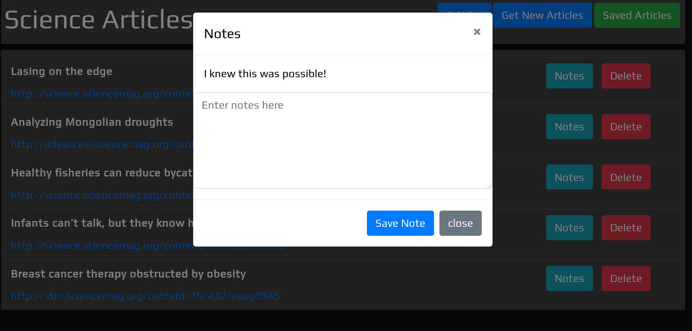

# scraper-cart
---
### A simple web scraping tool!

This is a simple web scraper that scrapes science articles and saves them in to a Mongo Database
It is written in javascript and uses express and handlebars
Deployed Link : scrapercart.herokuapp.com

---
#### Dependencies
```
nodejs , npm, mongodb
```
---
### Usage
```
  git clone "https://github.com/hmalle/scraper-cart"
  cd scraper-cart
  npm i
  node server.js
```
---




#### Packages used 
``` 
Express, Handlebars, Mongoose, Axios, Cheerio 
```
